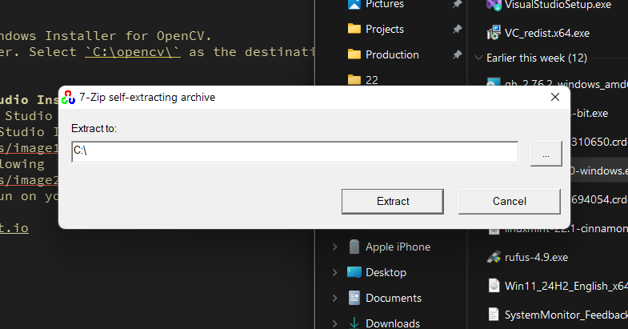
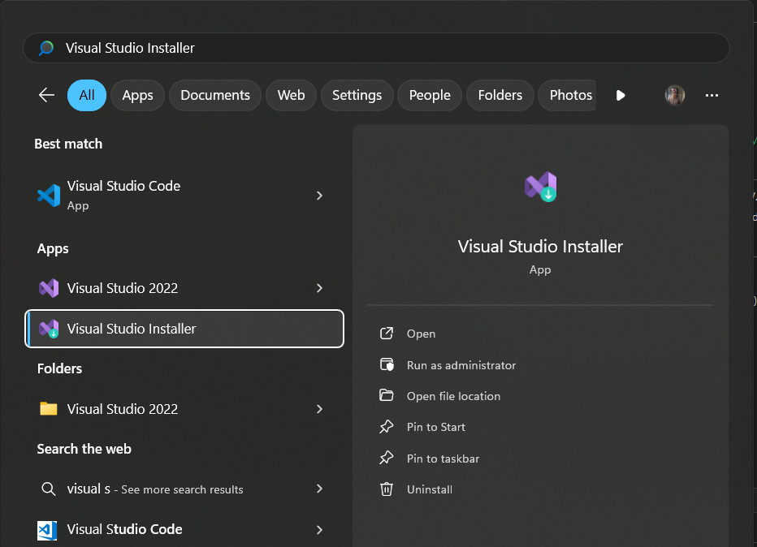
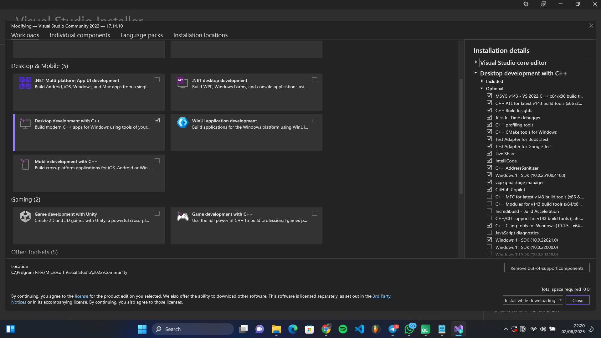

# GROUP 4 Mini Zoom Project

## Setup

Need to setup

- [Qt Creator (IDE for C++ GUI)](https://www.qt.io/download-qt-installer-oss)
- [OpenCV](https://opencv.org/releases/)
- g++/gcc compiler suite
- Git
- [New] [Microsoft Visual Studio C++ toolset (MSVC)](https://visualstudio.microsoft.com/vs/features/cplusplus/)

## OpenCV Setup
1. Download the Windows Installer for OpenCV.
2. Run the Installer. Select `C:\` as the extraction folder
    

## MSVC Setup
### With Visual Studio Installer
1. Download Visual Studio (Community version) from [here](https://visualstudio.microsoft.com/)
2. Run the Visual Studio Installer program 
    
3. Install the following
    
4. OpenCV should run on your system now

[1]: https://www.qt.io
